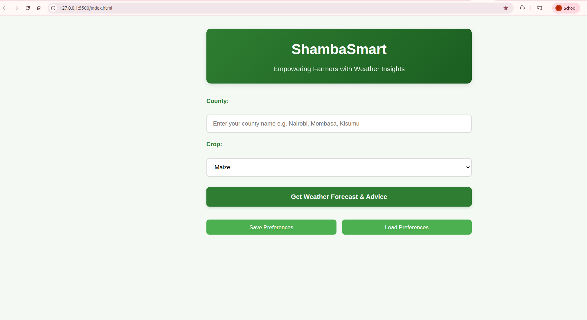
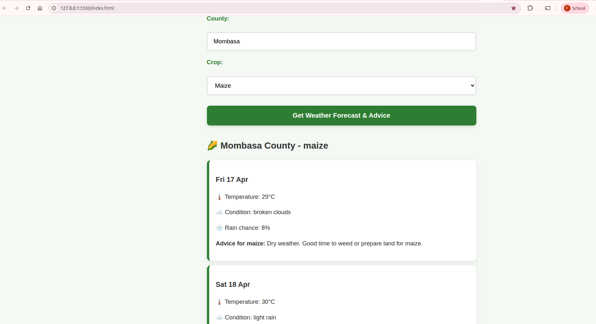

# 🌾 ShambaSmart - Weather Advisor for Kenyan Farmers

**ShambaSmart** is a simple, mobile-friendly web application designed to help smallholder farmers in Kenya make better farming decisions. It combines **5-day localized weather forecasts** with practical, crop-specific farming advice for common crops like maize, beans, potatoes, and kale (sukuma wiki).

## 🚀 Project Overview

This project addresses the real challenge faced by Kenyan farmers — unpredictable weather patterns due to climate change. By providing clear weather data and actionable advice (e.g., “Good time to plant” or “Delay planting due to heavy rain risk”), ShambaSmart helps reduce crop losses for rain-fed agriculture.

## ✨ Features

- 5-day weather forecast for Kenyan counties
- Crop-specific emojis and personalized farming advice
- Save and load user preferences (County + Crop) using `localStorage`
- Fully responsive and mobile-friendly design
- Clean, modern farming-themed user interface
- Proper error handling and user feedback

## 📸 Screenshots

### Main Interface


### Weather Forecast & Advice Result


## 🎯 How to Use

1. Open `index.html` in any modern web browser
2. Enter your county (e.g., Nairobi, Mombasa, Nakuru)
3. Select your crop from the dropdown
4. Click **"Get Weather Forecast & Advice"**
5. Use **Save Preferences** and **Load Preferences** buttons for faster access next time

**Tip:** The app works great on mobile phones — perfect for farmers in the field.

## 📂 Project Structure

```bash
shambasmart/
├── index.html
├── style.css
├── script.js
├── screenshots/
│   ├── main-interface.png
│   └── forecast-result.png
└── README.md